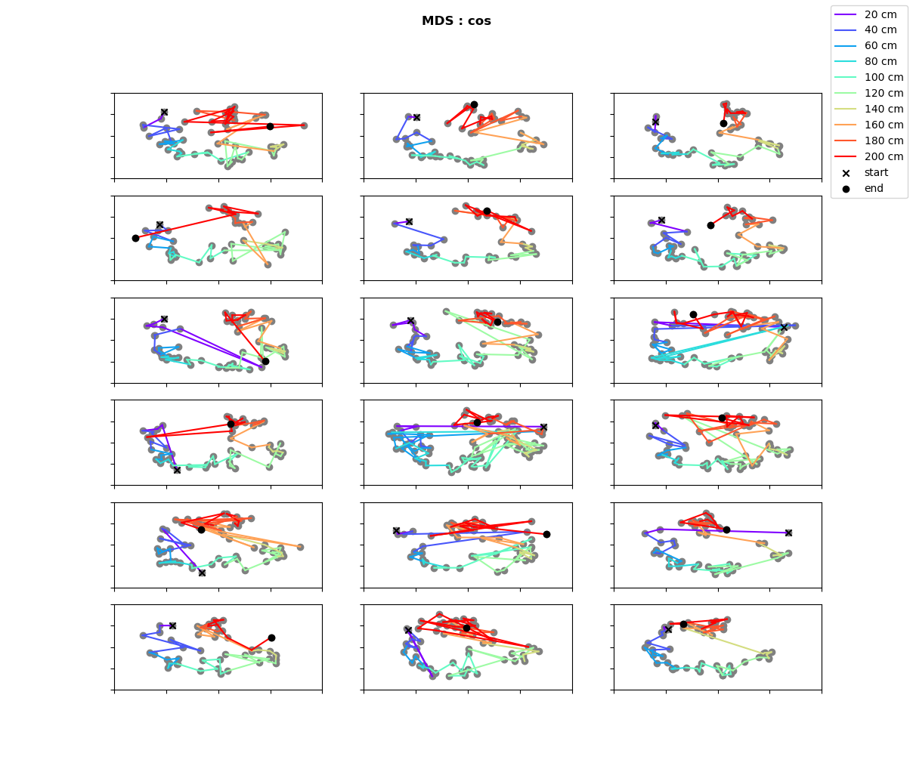
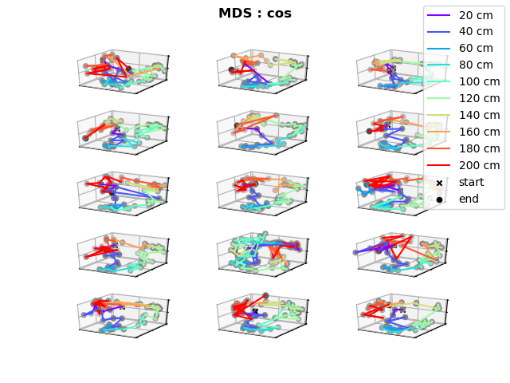
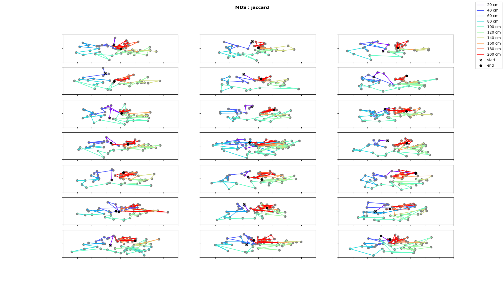
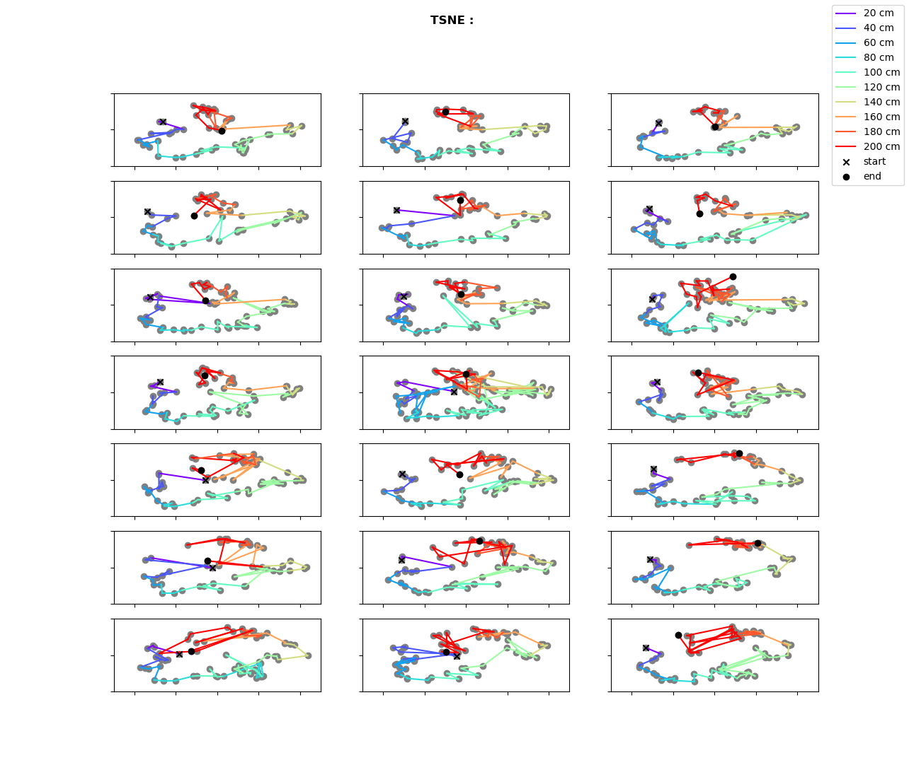
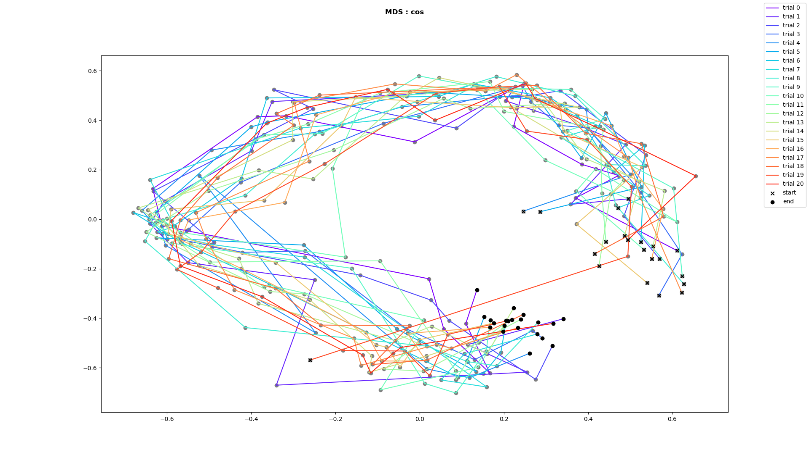
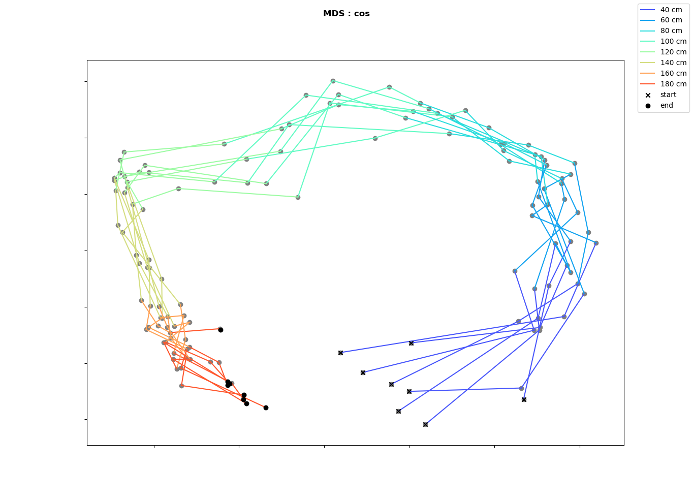
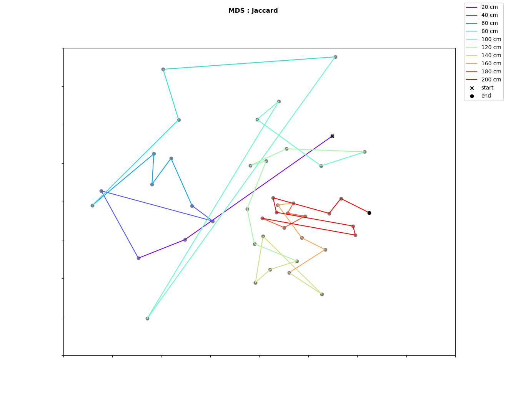
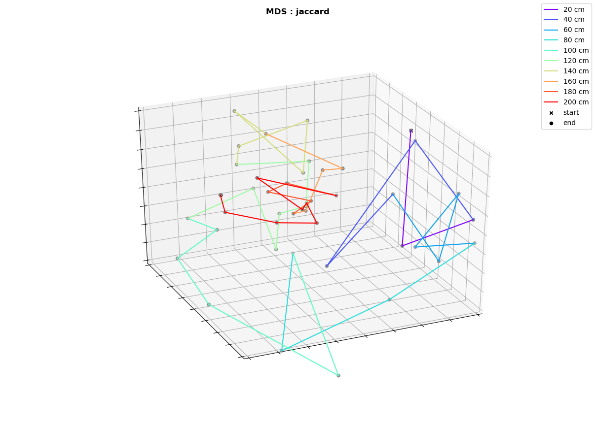

# MANIFOLD TRANSITION FOR RULE SWITCH: HPC

* rule switch after trial 7
* using concatenated trials for transformation and separating them afterwards
* filtered data where speed < 5 cm/s and all zero population vectors

## Results using time bins (0.1s)

### 1. Multidimensional scaling

#### Difference measure: cosine

* number of components: 2

* number of components: 3

#### Difference measure: jaccard

### 2. PCA

* title: contribution to variance of first and second principal component

### 3. TSNE

## Results using spatial bins (10cm)
* discarding first/last 20 cm

### 1. Multidimensional scaling

#### Difference measure: cosine
* all trials for rule switch in one plot 

# COMPARING MANIFOLDS FOR DIFFERENT RULES

### 1. Multidimensional scaling

#### Difference measure: cosine

##### Rule: light

# STATE TRANSITION ANALYSIS

* using "difference vectors" between population states
* filtered data where speed < 5 cm/s and all zero population vectors

## 1. Multidimensional scaling
### Difference measure: jaccard

