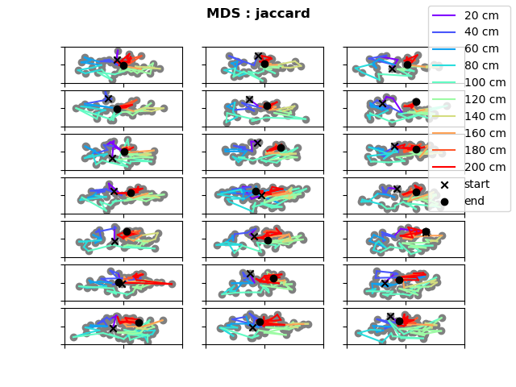

# Manifold transition for rule switch: HPC

* rule switch after trial 7
* using concatenated trials for transformation and separating them afterwards
* filtered data where speed < 5 cm/s and all zero population vectors

## 1. Multidimensional scaling

### Difference measure: cosine

* number of components: 2

* number of components: 3

### Difference measure: jaccard

## 2. PCA

* title: contribution to variance of first and second principal component

## 3. TSNE

