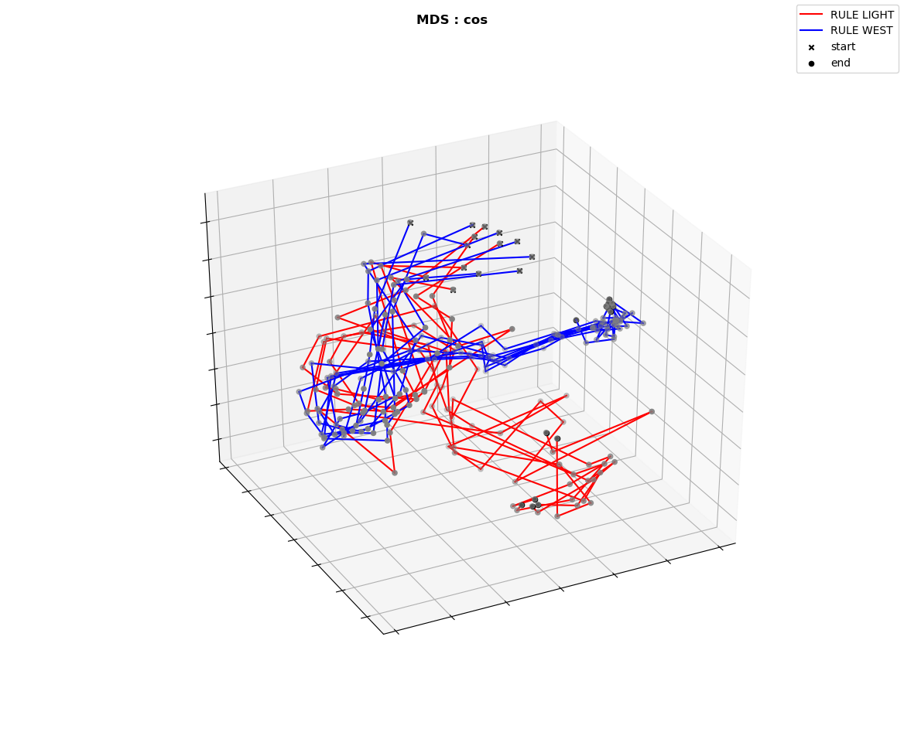
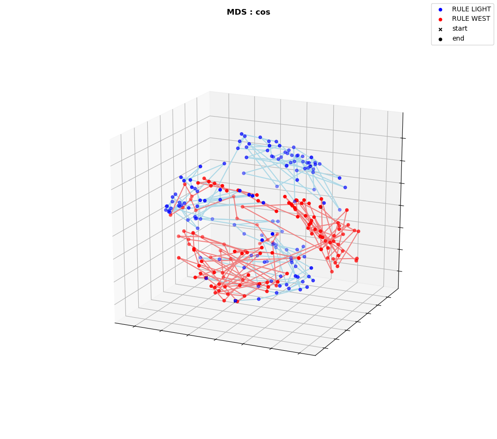
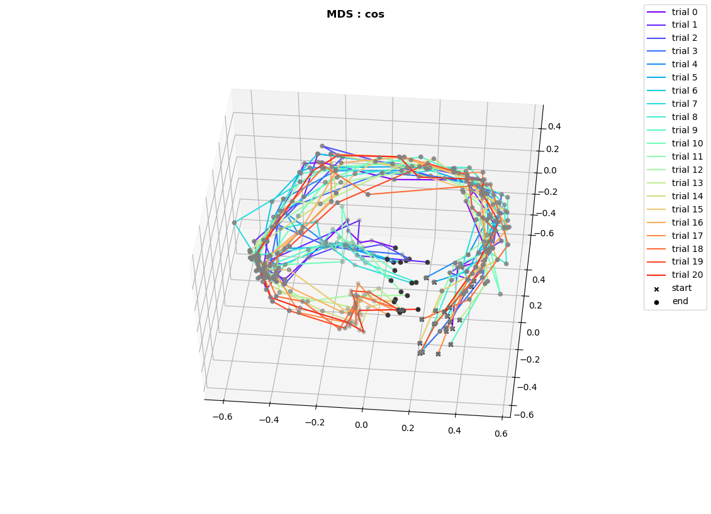
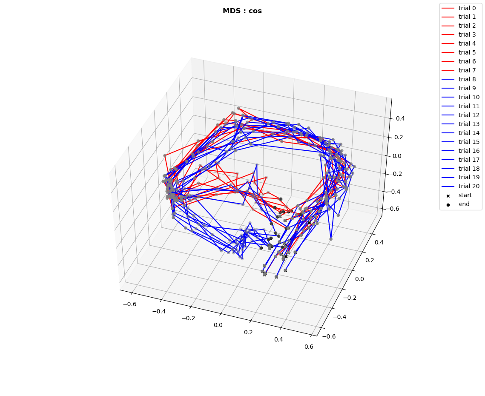

# COMPARING MANIFOLDS FOR DIFFERENT RULES: HPC

Do we see significant differences in the dynamics of the system for two different rules?

**Analysis methods**:
* same trajectories (start arm & goal arm)
* using concatenated data for transformation and separating them afterwards
* filtered data where speed < 5 cm/s and all zero population vectors
* dimensionality reduction: MDS, PCA etc.
* "confidence intervals" for each bin for each rule to find sections where manifolds differ significantly (comparing population states)
* characterizing/comparing dynamics: 
    * step length
    * step direction (angle between subsequent steps)
    * etc.

## Results using spatial bins (10 cm)

### 1. Multidimensional scaling

#### Difference measure: cosine

##### Rule: light

* variability is quite different for different bins (greater in the center)

##### Light vs. west

* red is light, blue is west

## Results using time bins (0.1 s)

### 1. Multidimensional scaling

#### Difference measure: cosine

##### Comparison using one trial for each rule

* how does the difference look like using all trials for both cases?

# MANIFOLD TRANSITION FOR RULE SWITCH: HPC

Can we characterize the transition of the manifold during the rule switch?

**Analysis methods**:
* same trajectories (start arm & goal arm)
* using concatenated trials for transformation and separating them afterwards
* filtered data where speed < 5 cm/s and all zero population vectors
* dimensionality reduction: MDS, PCA etc.
* analysing the transition:
    * rigid rotation?
    * translation?
    * stretching?

## Results using time bins (0.1s)

### 1. Multidimensional scaling

#### Difference measure: cosine

* rule switch after trial 7

* rule switch after trial 7

#### Difference measure: jaccard

### 2. PCA

* title: contribution to variance of first and second principal component

### 3. TSNE

## Results using spatial bins (10cm)
* discarding first/last 20 cm

### 1. Multidimensional scaling

#### Difference measure: cosine
* all trials for rule switch in one plot 

* visible separation for both rules (light --> go west)
* maybe use trials in between (not successful ones) to see how the remapping actually happens

# STATE TRANSITION ANALYSIS: HPC

"Operations" that can change the state of the system. Do we see differences for different rules/spatial positions/rule switching? 

**Analysis methods:**
* filtered data where speed < 5 cm/s and all zero population vectors
* calculate "difference vectors" between two subsequent population vectors
* dimensionality reduction: MDS, PCA etc.

## 1. Multidimensional scaling
### Difference measure: jaccard

