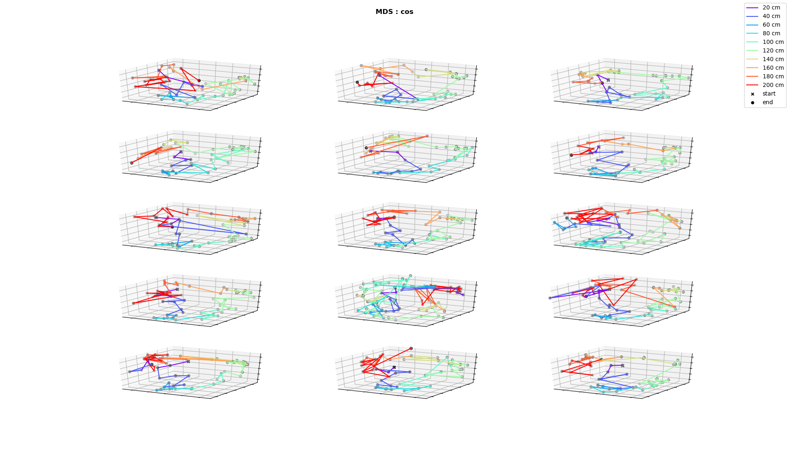

# Manifold transition for rule switch

## 1. Multidimensional scaling

### Difference measure: cosine

* rule switch after trial 7
* using concatenated trials for transformation and separating them afterwards
* number of components: 2

* number of components: 3

