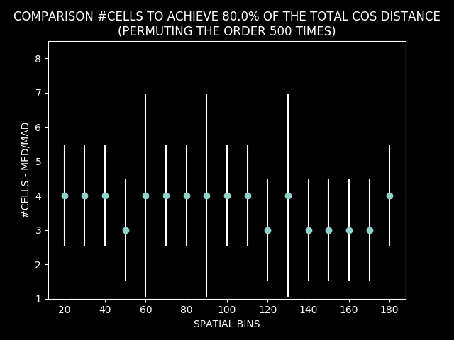
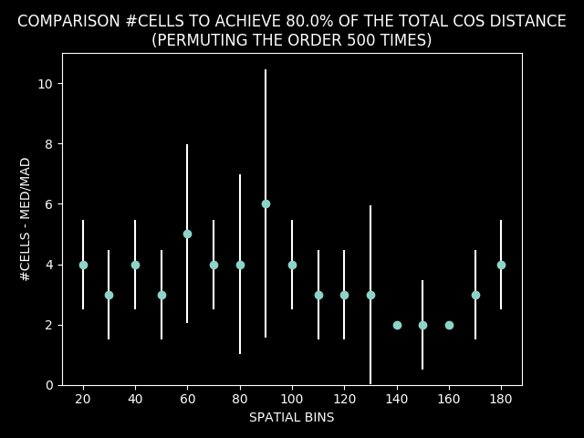

# REMAPPING: RULE A VS. RULE B

## all sessions

### cosine distance

**Analysis methods**:
* combine all values for each spatial bin
* plot median and mad for each bin

* count number of sessions that remapped significantly per spatial bin

### #cells for remapping
**Analysis methods**:
* combine all values for each spatial bin
* plot median and mad for each bin

### correlation: cosine distance vs. #cells for remapping

## sessions for rule LIGHT then rule WEST

### cosine distance

**Analysis methods**:
* combine all values for each spatial bin
* plot median and mad for each bin

* count number of sessions that remapped significantly per spatial bin

### #cells for remapping
**Analysis methods**:
* combine all values for each spatial bin
* plot median and mad for each bin

### correlation: cosine distance vs. #cells for remapping

# REMAPPING: RULE A --> RULE B

## all sessions

### cosine distance

**Analysis methods**:
* combine all values for each spatial bin
* plot median and mad for each bin

* count number of sessions that remapped significantly per spatial bin

### #cells for remapping
**Analysis methods**:
* combine all values for each spatial bin
* plot median and mad for each bin

### correlation: cosine distance vs. #cells for remapping

## sessions for rule LIGHT then rule WEST

### cosine distance

**Analysis methods**:
* combine all values for each spatial bin
* plot median and mad for each bin

* count number of sessions that remapped significantly per spatial bin

### #cells for remapping
**Analysis methods**:
* combine all values for each spatial bin
* plot median and mad for each bin

### correlation: cosine distance vs. #cells for remapping

