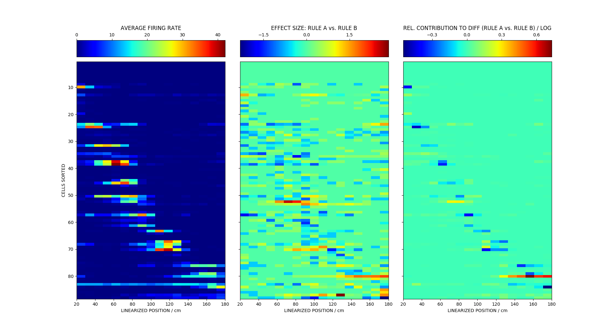
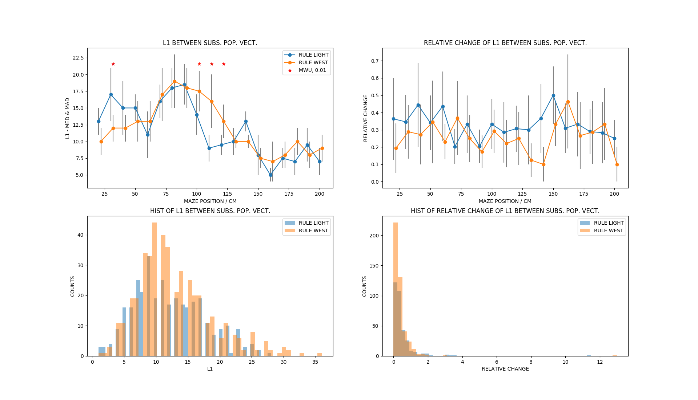
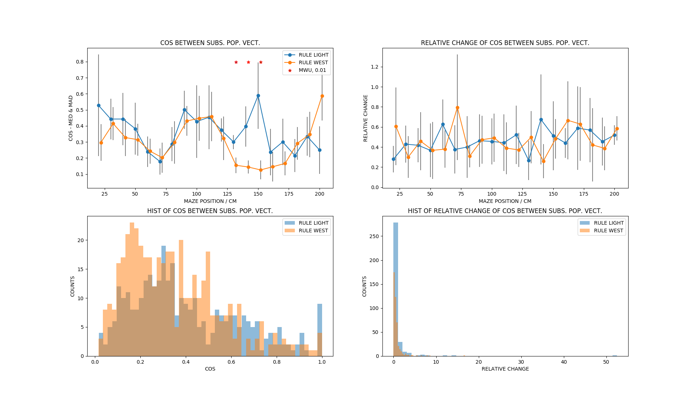
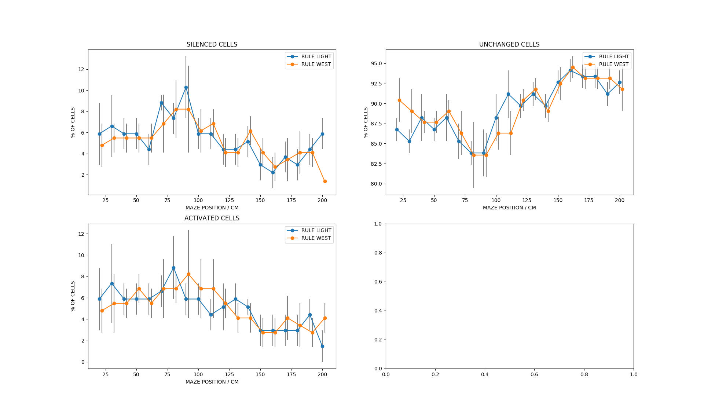

# TRANSITION FOR RULE SWITCH (_4): HPC

Can we identify remapping/ changes in the dynamics during the rule switch?

## Multidimensional scaling using cosine distance

**Analysis methods**:
* same trajectories (start arm & goal arm)
* using concatenated trials for transformation and separating them afterwards
* filtered data where speed < 5 cm/s and all zero population vectors
* dimensionality reduction: MDS and cosine

* separation visible

* remapping most obvious in goal arm

## Quantification 

**Overal distance**:
* within rule cos-distance vs. accross rules cos-distance
  * calculate pair-wise cos distance between trials of RULE 1 and RULE 2 for each
spatial bin
  * plot MED/MAD of these pair-wise distances for each spatial bin
  * normalization: divide median of across-rule cos distances by within rule cos median
distance for each spatial bin
  * mann-whitney u test, alpha = 0.01
* filtered data where speed < 5 cm/s and all zero population vectors

* can we tell something from different results of the normalization by rule 1 and rule b?

histograms of within vs. across rule cos distance

**Separating trials**:
* for each spatial bin and trial after the switch:
    * pair-wise cos differences between trail and each trial before the switch
    --> get array for all comparisons
    * taking the median

* continuous remapping for certain spatial positions. To measure the actual effect the
across-trial variability without rule switch needs to be taken into account.

## Identifying cells that contribute to difference

* average firing rate using both rules
* effect size: diff / pooled std
* contribution to cos diff: leave-one-out analysis

* removing two most influential cells significantly reduces the cosine difference for the rule switch
for the last couple of spatial bins

* difference is not statistically significant anymore:

# RULE LIGHT (_2) VS. RULE WEST (_4)

Do we see significant differences in the dynamics of the system for two different rules?

## Multidimensional scaling using cosine distance
**Analysis methods**:
* same trajectories (start arm & goal arm)
* using concatenated trials for transformation and separating them afterwards
* filtered data where speed < 5 cm/s and all zero population vectors
* dimensionality reduction: MDS and cosine

### Rule: light

* variability is quite different for different bins (greater in the center)

### Rule: west

### Light vs. west

* apparent difference between both rules

## Quantification

Do we see significant differences in the dynamics of the system for two different rules?

**Overal distance: RULE 1 (_2/_4) vs. RULE 2 (_6)**:

* calculate pair-wise cos distance between trials of RULE 1 and RULE 2 for each
spatial bin
* plot MED/MAD of these pair-wise distances for each spatial bin
* normalization: divide median of across-rule cos distances by within rule cos median
distance for each spatial bin
* significance: across-rules distance vs. union of within-rule distances

distribution of within and across rule distance:

**Separating trials: RULE 1 (_2,_4) vs. RULE 2 (_6)**:
* for each spatial bin and trial of RULE 2:
    * pair-wise cos differences between trial and each trial of RULE 1
    --> get array for all comparisons
    * taking the median

* relatively constant population states
* between 60 and 110 cm there seem to be clusters of different dynamics
    * can maybe check with parameters of the experiments what the difference might be
    due to

## Identifying cells that contribute to difference: RULE 1 (_2,_4) vs. RULE 2 (_6):

* average firing rate using both rules
* effect size: diff / pooled std
* contribution to cos diff: leave-one-out analysis

* removing two most influential cells:

* difference seem to depend on other cells after the initial transition as well:

* significance is still given for the last 30 cm

## Comparison for same rule before/after sleep

* remapping also happens without a rule switch --> seems to be happening
in different spatial locations

# GLOBAL VS. LOCAL REMAPPING

* using alternative to leaving-one-out analysis
  
* using shuffling:

  * select subset of n cells randomly and calculate cosine difference
  * repeat for 200 times

* Synthetic data:

* using cohens' d:

# STATE TRANSITION ANALYSIS

## L1 norm between subsequent population vectors

## Cosine distance between subsequent population vectors

## Operations 

* using difference vectors between two subsequent population vectors 
* making difference vectors signed binary
* counting -1 (silencing), 0 (unchanged), +1 (activated)

# Conclusion

* if rather local remapping for rule A vs. rule B --> results highly depend on cells that
we record from

* is re-consolidation rather global? 

* do we have a local --> global remapping?

* FPC data looks very different --> use other distance measures/methods?