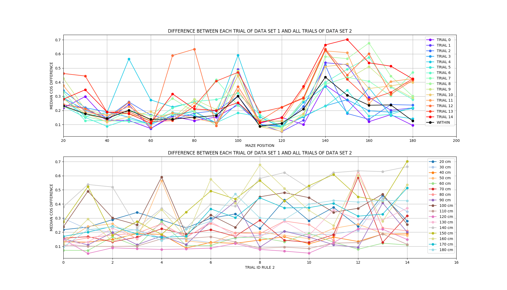

# POPULATION VECTOR DIFFERENCE DURING RULE SWITCH: HPC

Can we characterize the transition of the population states during rule switch?

**Analysis methods**:
* within rule cos-distance vs. accross rules cos-distance
* filtered data where speed < 5 cm/s and all zero population vectors

## Results using spatial bins (10cm)

* RULE 1: light, RULE 2: west

**Overall distance**:
* calculate pair-wise cos distance between trials of RULE 1 and RULE 2 for each
spatial bin
* plot average/SEM of these pair-wise distances for each spatial bin
* normalization: divide average of across-rule cos distances by within rule cos 
distance for each spatial bin

* above plot considers union of all trials
* can we tell something from different results of the normalization by rule 1 and rule b?

**Separating trials**:
* for each spatial bin and trial after the switch: 
    * pair-wise cos differences between trail and each trial before the switch
    --> get array for all comparisons
    * taking the average

* continuous remapping for certain spatial positions. To measure the actual effect the 
across-trial variability without rule switch needs to be taken into account.

# POPULATION VECTOR DIFFERENCE COMPARISON OF DIFFERENT RULES

Do we see significant differences in the dynamics of the system for two different rules?

**Separating trials**:
* for each spatial bin and trial after the switch: 
    * pair-wise cos differences between trail and each trial before the switch
    --> get array for all comparisons
    * taking the average
* comparing trials of the next day session (_6, RULE WEST) with trials of the rule switch session
with RULE LIGHT

