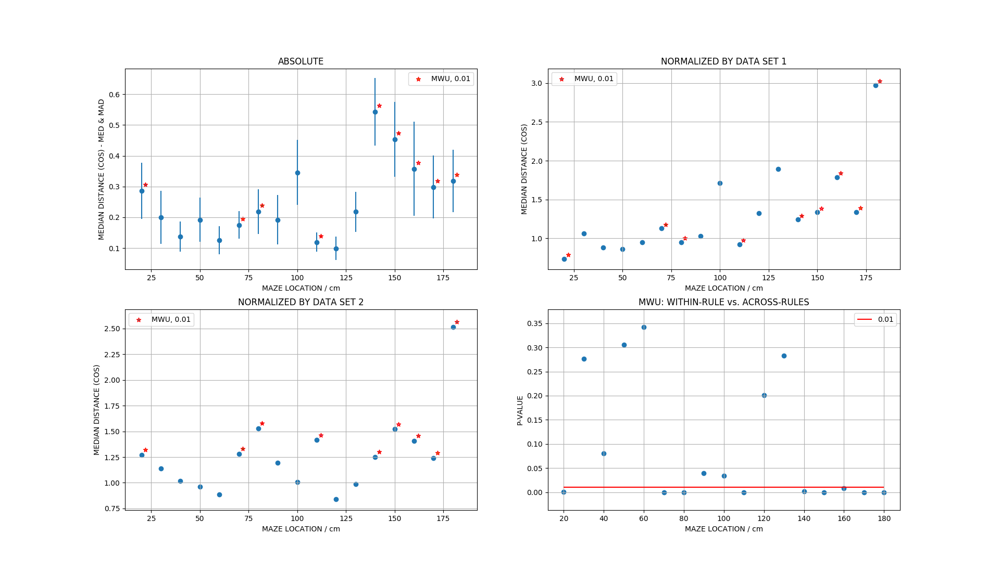

# POPULATION VECTOR DIFFERENCE DURING RULE SWITCH: HPC

Can we characterize the transition of the population states during rule switch?

**Analysis methods**:
* within rule cos-distance vs. accross rules cos-distance
* filtered data where speed < 5 cm/s and all zero population vectors

## Results using spatial bins (10cm)

* RULE 1: light, RULE 2: west

* above plot considers union of all trials
* can we tell something from different results of the normalization by rule 1 and rule b?

* continuous remapping for certain spatial positions. To measure the actual effect the 
across-trial variability without rule switch needs to be taken into account.