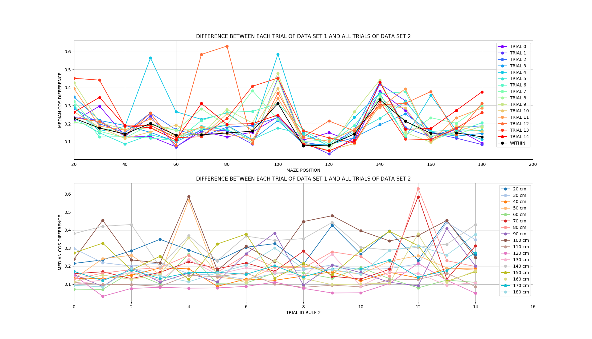
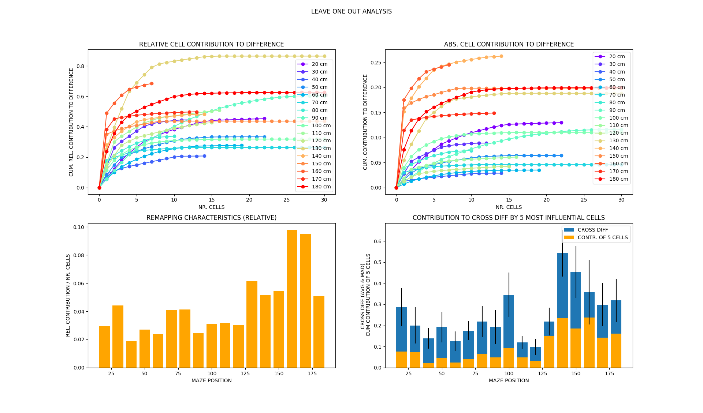
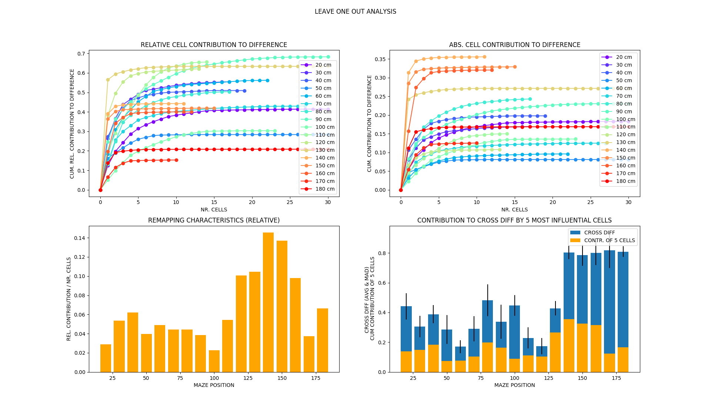
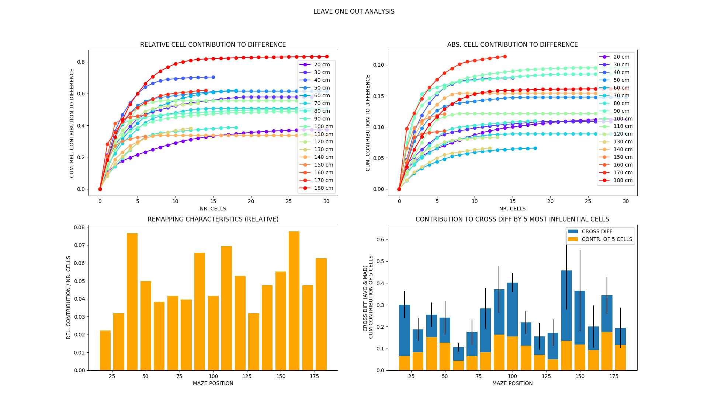

# POPULATION VECTOR DIFFERENCE (REMAPPING) DURING RULE SWITCH: HPC

Can we characterize the transition of the population states during rule switch?

**Analysis methods**:
* within rule cos-distance vs. accross rules cos-distance
* filtered data where speed < 5 cm/s and all zero population vectors

## Results using spatial bins (10cm)

* RULE 1: light, RULE 2: west

**Overall distance**:
* calculate pair-wise cos distance between trials of RULE 1 and RULE 2 for each
spatial bin
* plot average/SEM of these pair-wise distances for each spatial bin
* normalization: divide average of across-rule cos distances by within rule cos
distance for each spatial bin

* above plot considers union of all trials
* can we tell something from different results of the normalization by rule 1 and rule b?

histograms of within vs. across rule cos distance

**Separating trials**:
* for each spatial bin and trial after the switch:
    * pair-wise cos differences between trail and each trial before the switch
    --> get array for all comparisons
    * taking the average

* continuous remapping for certain spatial positions. To measure the actual effect the
across-trial variability without rule switch needs to be taken into account.

## Identifying cells that contribute to difference

* average firing rate using both rules
* effect size: diff / pooled std
* contribution to cos diff: leave-one-out analysis
* change of p-value for KW (within div. vs. across div.) using leave-one-out analysis

* removing cells 46 and 69 significantly reduces the cosine difference for the rule switch
for the last couple of spatial bins

# COMPARISON OF POPULATION VECTORS FOR DIFFERENT RULES

Do we see significant differences in the dynamics of the system for two different rules?

**Overal distance: RULE 1 (_2/_4) vs. RULE 2 (_6)**:

* calculate pair-wise cos distance between trials of RULE 1 and RULE 2 for each
spatial bin
* plot average/SEM of these pair-wise distances for each spatial bin
* normalization: divide average of across-rule cos distances by within rule cos
distance for each spatial bin
* significance: across-rules distance vs. union of within-rule distances

distribution of within and across rule distance:

**Separating trials: RULE 1 (_2,_4) vs. RULE 2 (_6)**:
* for each spatial bin and trial of RULE 2:
    * pair-wise cos differences between trial and each trial of RULE 1
    --> get array for all comparisons
    * taking the median

* relatively constant population states
* between 60 and 110 cm there seem to be clusters of different dynamics
    * can maybe check with parameters of the experiments what the difference might be
    due to

## Identifying cells that contribute to difference

* average firing rate using both rules
* effect size: diff / pooled std
* contribution to cos diff: leave-one-out analysis
* change of p-value for KW (within div. vs. across div.) using leave-one-out analysis

* removing cells 46 and 69:

* difference seem to depend on other cells after the initial transition as well

# CELL CONTRIBUTION TO DIFFERENCE

## rule light vs. rule west during rule switch

## rule light (2, 4) vs. rule west (6)

* 3 cases:

  * cum. rel. contribution low: cannot account for majority difference by single
  cells using leave-one-out --> global remapping

  * steep raise for first couple of cells: major contribution to difference from
  few cells --> local remapping

  * monotonically increasing curve: several cells contribute majorly to
  difference --> between global and local remapping

## rule light before (2) /after sleep (4)

# COMPARISON OF POPULATION VECTORS FOR SAME RULE BEFORE/AFTER SLEEP

* remapping also happens without a rule switch --> seems to be happening
in different spatial locations

